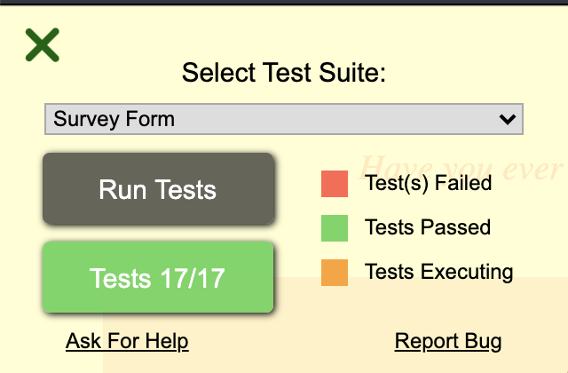

This is Anna Macdonald's completion of [FreeCodeCamp's survey form project](https://www.freecodecamp.org/learn/responsive-web-design/responsive-web-design-projects/build-a-survey-form).

[See a preview of the page.](http://annafirtree.github.io/fcc-survey-form)

Tests were passed:

To come up with the theme of the page, I used a random word generator that gave me the word "Amputate". I have a couple of kids who are very into morbid humor, so I decided to run with it.

Things I learned doing this project:

* Using smart quotes around html properties renders ok in Visual Studio Code, but not in CodePen.
* \<input type="email">, \<input type="number">, and \<select> for dropdowns are all things that exist in HTML5.
* You cannot give something a negative border radius to make it poke out instead of curve around.
* According to at least one StackExchange, naming GitHub repos is best done with "survey-form" style, not "survey_form" or camelCaps.